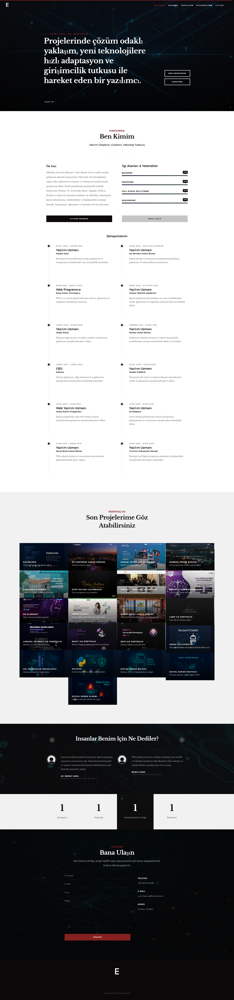

# 🧰 Emir Baycan – C# Portfolio Website

Bu repository, kişisel portfolyo web sitemin kaynak kodlarını içerir. **ASP.NET Core MVC** ile geliştirilmiş; deneyimlerim, projelerim ve teknik becerilerim modern, sürdürülebilir ve modüler bir yapı ile sergilenir. PostgreSQL veritabanı ve Docker ile "one-click run" desteğiyle kolay kurulum sağlar.

> 🌐 **Canlı Demo:** [csharp.emirbaycan.com.tr](https://csharp.emirbaycan.com.tr)

---

## 🚀 Özellikler

* **Dinamik İçerik Yönetimi:** Deneyimler, projeler ve yetenekler kolayca güncellenebilir.
* **Duyarlı Tasarım:** Tüm cihazlarda sorunsuz görüntülenme.
* **Modüler Mimari:** Kolayca ölçeklenebilir ve yeni özellikler eklenebilir.
* **SEO ve Performans Optimizasyonu:** Hızlı yükleme, arama motoru dostu yapı.
* **Tek Tuşla Çalıştırma:** Docker Compose ile uygulama ve PostgreSQL veritabanı tek komutla ayağa kalkar.
* **Güncel Proje Klasör Yapısı:** Best-practice MVC dizin organizasyonu.

---

## 🛠️ Kullanılan Teknolojiler

* **Frontend:** HTML5, CSS3, JavaScript, Razor Views
* **Backend:** ASP.NET Core MVC, C#
* **Database:** PostgreSQL (Dockerize edilmiş, Entity Framework Core ile)
* **Containerization:** Docker & Docker Compose
* **Version Control:** Git & GitHub
* **Deployment:** Ubuntu sunucu, Apache (Reverse Proxy ile HTTPS destekli)

---

## 📁 Project Structure

```
MyPortfolioProject/
├── wwwroot/
│   ├── Admin-theme/
│   ├── login-theme/
│   ├── portfolio-theme/
│   ├── css/
│   ├── icons/
│   ├── images/
│   ├── js/
│   ├── lib/
│   ├── ProjectScreenShoots/
│   │   └── full_page.png
│   └── favicon.ico
├── Controllers/
│   ├── AboutController.cs
│   ├── AdminLoginController.cs
│   ├── ContactController.cs
│   ├── DefaultController.cs
│   ├── ExperienceController.cs
│   ├── FeatureController.cs
│   ├── MessageController.cs
│   ├── PortfolioController.cs
│   ├── ProfileController.cs
│   ├── SkillController.cs
│   ├── SocialMediaController.cs
│   ├── StatisticController.cs
│   ├── TestimonialController.cs
│   └── ToDoListController.cs
├── DAL/
│   ├── Context/
│   ├── Entities/
│   └── Extensions/
├── Helpers/
│   └── Images/
├── Migrations/
├── Models/
│   ├── ViewModel/
├── ViewComponents/
│   ├── AdminStatisticComponent/
│   └── LayoutViewComponents/
│       └── (Partial view component dosyaları)
├── Views/
│   ├── About/
│   ├── AdminLogin/
│   ├── Contact/
│   ├── Default/
│   ├── Experience/
│   ├── Feature/
│   ├── Message/
│   ├── Portfolio/
│   ├── Profile/
│   └── Shared/
│       └── Components/
│           └── (Partial view dosyaları)
├── appsettings.json
├── docker-compose.yml
└── Program.cs
```

Proje ekran görüntüleri:

```
wwwroot/ProjectScreenShoots/full_page.png
```

---

## ⚙️ Hızlı Başlangıç (One-Click Run)

### Gereksinimler

* [Docker](https://www.docker.com/products/docker-desktop/) (Linux için native veya Docker Engine)
* [.NET 6 SDK](https://dotnet.microsoft.com/en-us/download/dotnet/6.0) (geliştirme ve EF komutları için)

### Kurulum ve Çalıştırma (Geliştirme Amaçlı)

1. **Projeyi klonla:**

   ```bash
   git clone https://github.com/emirbaycan/portfolio-c-sharp.git
   cd portfolio-c-sharp
   ```

2. **Veritabanını ve uygulamayı Docker Compose ile başlat:**

   ```bash
   docker-compose up -d
   ```

3. **EF Core ile veritabanını oluştur:**

   ```bash
   dotnet ef database update
   ```

4. **Uygulamayı çalıştır:**

   ```bash
   dotnet run
   # veya:
   dotnet publish -c Release -o publish
   cd publish && dotnet MyPortfolioProject.dll
   ```

   Varsayılan olarak [http://localhost:5000](http://localhost:5000) üzerinden yayın yapar.

---

## 🔧 Yayın (Production Deployment)

### Sunucu Kurulumu (Ubuntu)

1. Şu klasörü sunucuya kopyalayın:

   ```bash
   dotnet publish -c Release -o publish
   scp -r publish/ youruser@yourserver:/var/www/csharp/
   ```

2. Sunucuda çalıştır:

   ```bash
   cd /var/www/csharp/
   dotnet MyPortfolioProject.dll --urls "http://localhost:5050"
   ```

3. Apache Reverse Proxy Ayarı (/etc/apache2/sites-available/yourproject.conf):

   ```apache
   <VirtualHost *:80>
       ServerName csharp.emirbaycan.com.tr
       RewriteEngine on
       RewriteCond %{SERVER_NAME} =csharp.emirbaycan.com.tr
       RewriteRule ^ https://%{SERVER_NAME}%{REQUEST_URI} [END,NE,R=permanent]
   </VirtualHost>

   <IfModule mod_ssl.c>
   <VirtualHost *:443>
       ServerName csharp.emirbaycan.com.tr

       SSLEngine on
       SSLCertificateFile /etc/letsencrypt/live/csharp.emirbaycan.com.tr/fullchain.pem
       SSLCertificateKeyFile /etc/letsencrypt/live/csharp.emirbaycan.com.tr/privkey.pem
       Include /etc/letsencrypt/options-ssl-apache.conf

       ProxyPreserveHost On
       ProxyPass / http://localhost:5050/
       ProxyPassReverse / http://localhost:5050/
   </VirtualHost>
   </IfModule>
   ```

4. Apache yeniden yüklenir:

   ```bash
   sudo a2enmod proxy proxy_http rewrite ssl
   sudo a2ensite yourproject.conf
   sudo systemctl reload apache2
   ```

---

## 🔮 Test

Testler `Tests/` klasöründe (varsa) bulunur. Çalıştırmak için:

```bash
dotnet test
```

---

## 📸 Ekran Görüntüleri

Ana sayfa genel görünüm:



---

## 📬 İletişim

Her türlü öneri veya iş birliği için:

* **Email**: [emir-baycan@hotmail.com](mailto:emir-baycan@hotmail.com)
* **Website**: [emirbaycan.com.tr](https://emirbaycan.com.tr)

---

## 📄 Lisans

Bu proje [MIT Lisansı](LICENSE) ile lisanslanmıştır.
